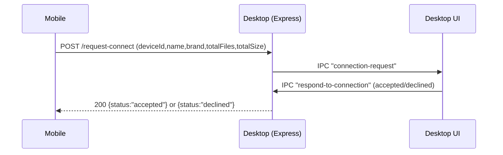
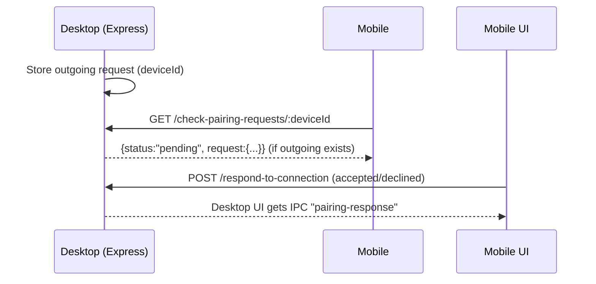
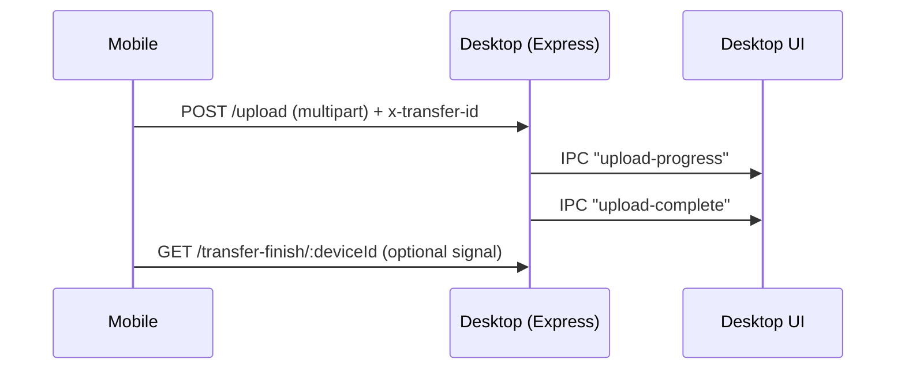
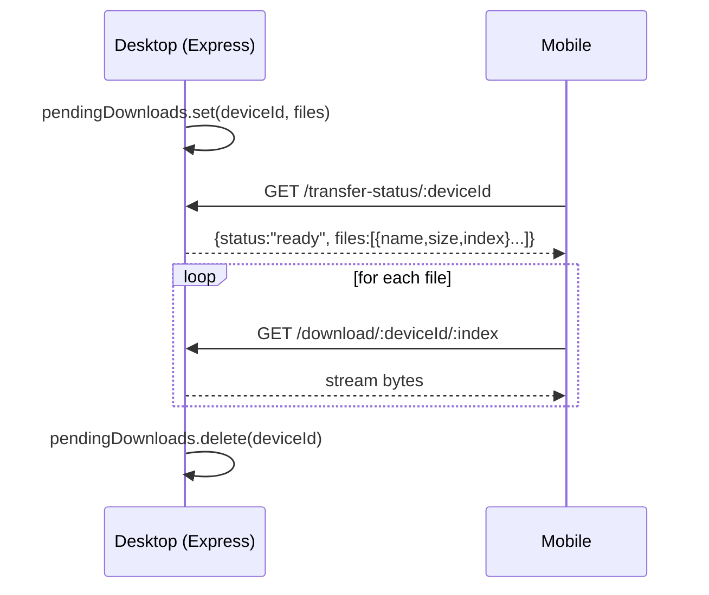

# How ExLink Works

This document explains ExLink’s **end-to-end workflow**: discovery → pairing → transfer, and points you to the key files that implement each step.

If you want a deeper code snapshot, also see `CODEBASE_ANALYSIS.md`.

## High level architecture

ExLink is split into two apps:

- **Desktop** (`desktop/`): runs the **network services**
  - UDP discovery broadcaster/listener
  - Express HTTP server for pairing and file transfer
  - Renderer UI that shows Receive/Send/Settings
- **Mobile** (`mobile/`): runs the **client**
  - subnet scanning for desktops
  - pairing UI + upload/download client logic

## Ports

- UDP discovery: `41234`
- Desktop HTTP server: `3030`

## Key files (by responsibility)

### Desktop

- **Server + discovery + IPC**: `desktop/electron/main.ts`
- **IPC bridge**: `desktop/electron/preload.ts`
- **UI shell (tabs + overlays)**: `desktop/src/App.tsx`
- **Send UI**: `desktop/src/components/pages/SendPage.tsx`
- **Receive UI (shows device name/id)**: `desktop/src/components/pages/ReceivePage.tsx`
- **Settings (device name + theme)**: `desktop/src/components/pages/SettingsPage.tsx`

### Mobile

- **Global scanning/announce loop**: `mobile/app/_layout.tsx`
- **Tab router + tab bar**: `mobile/app/(tabs)/_layout.tsx`
- **Send screen**: `mobile/app/(tabs)/send.tsx`
- **Send transfer portal (pair + upload)**: `mobile/components/SendingPortal.tsx`
- **Receive screen (poll + download)**: `mobile/app/(tabs)/receive.tsx`
- **Settings (device name + theme)**: `mobile/app/(tabs)/settings.tsx`

## Device identity (name + id)

Both apps show a **device name** on the Receive screen.

- Desktop name is stored by the Electron main process (and used in `/get-server-info` and discovery messages).
- Mobile name is stored in AsyncStorage (`deviceName`).

IDs are currently based on **the last octet of the local IPv4 address** (example: `192.168.1.42` → `42`).

## Discovery flow

### Desktop → LAN (UDP broadcast)

Desktop broadcasts a JSON message every few seconds:

- Implemented in `desktop/electron/main.ts` (UDP socket + broadcast loop)
- Port: `41234`

Example payload shape:

```json
{
  "type": "discovery",
  "id": "42",
  "name": "My Desktop",
  "ip": "192.168.1.42",
  "port": 3030,
  "platform": "desktop",
  "os": "Windows"
}
```

### Mobile → LAN (subnet scan + announce)

Mobile scans the local subnet (IPv4 only) for a desktop server:

- Requests: `GET http://{ip}:3030/get-server-info`
- On success: `POST http://{ip}:3030/announce` (mobile identity)

Implemented in:

- `mobile/app/_layout.tsx` (global background scanning + periodic announce)
- `mobile/app/(tabs)/send.tsx` (on-demand scan for the Send screen)

## Pairing flow (accept / decline)

Pairing is a “permission check” before transfer.

There are two pairing mechanisms, depending on initiator and platform.

### A) Mobile → Desktop (direct request/response)

Mobile sends a pairing request:

- **Request**: `POST /request-connect`
- **Desktop UI** shows accept/decline
- **Desktop server** responds to that HTTP request with `{ status: "accepted" | "declined" }`

Mermaid sequence:



Files involved:

- Server endpoint: `desktop/electron/main.ts` (`POST /request-connect`)
- Desktop accept/decline: `desktop/src/App.tsx` + `ipcMain.handle('respond-to-connection', ...)`
- Mobile request: `mobile/components/SendingPortal.tsx`

### B) Desktop → Mobile (mobile polls)

Because mobile doesn’t run a local HTTP server, the desktop records an outgoing request and mobile polls the desktop:

- Desktop stores an outgoing request in memory
- Mobile polls: `GET /check-pairing-requests/:deviceId`
- Mobile shows accept/decline UI and responds via `POST /respond-to-connection`

Mermaid sequence:



Files involved:

- Desktop outgoing storage + polling endpoint: `desktop/electron/main.ts`
- Mobile polling loop: `mobile/app/(tabs)/receive.tsx`

## Transfer flows

### 1) Mobile → Desktop (upload)

After pairing is accepted, mobile uploads selected files:

- **Upload**: `POST /upload` with multipart form data and header `x-transfer-id`
- Desktop writes files to disk and emits progress to the UI

Mermaid sequence:



Files involved:

- Server upload handler: `desktop/electron/main.ts` (`POST /upload`)
- Mobile upload: `mobile/components/SendingPortal.tsx`
- Desktop UI overlay: `desktop/src/App.tsx`

### 2) Desktop → Desktop (push upload)

Desktop reads files from disk and pushes them to the target desktop:

- `POST http://{targetIp}:3030/upload` with a boundary-based streaming body
- UI progress comes from the sender’s stream progress tracker

Implemented in `desktop/electron/main.ts` (`ipcMain.handle('start-transfer', ...)`).

### 3) Desktop → Mobile (queue + pull downloads)

Desktop cannot reliably “push” to mobile, so it queues files and mobile pulls:

1. Desktop stores `pendingDownloads[deviceId] = files[]`
2. Mobile polls: `GET /transfer-status/:deviceId`
3. Mobile downloads each file: `GET /download/:deviceId/:index`

Mermaid sequence:



Files involved:

- Desktop queue + download endpoints: `desktop/electron/main.ts`
- Mobile receiver: `mobile/app/(tabs)/receive.tsx`

## Notes / limitations

- The current protocol assumes a **trusted LAN** (no TLS/auth).
- Device IDs are IP-derived and may collide if IPs change.
- Some state (pending requests/download queue) is in-memory on desktop; restarting the desktop clears it.

