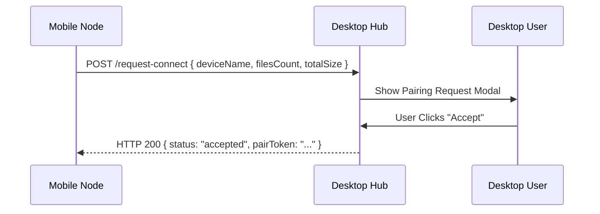
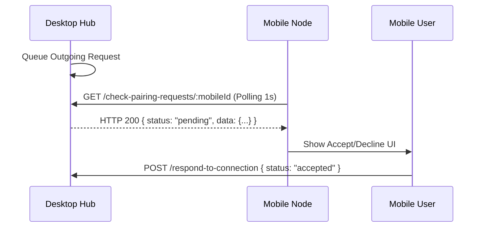

# 📖 How ExLink Works

This document provides a deep dive into the **ExLink Protocol** and the architectural decisions that power our high-speed, localized file transfers.

---

## 🏗️ High-Level Architecture

ExLink follows a **Node-based Client-Server model** within the local area network (LAN). The roles are dynamic depending on who is sending and who is receiving.

- **Desktop Subsystem (`/desktop`)**:
  - Acts as the primary **Network Hub**.
  - Runs a high-performance **Express.js** HTTP server for handling streaming payloads.
  - Manages **UDP Broadcasts** to announce presence to other nodes.
  - Implements the **Electron Main Process** for file system access and system-level networking.

- **Mobile Subsystem (`/mobile`)**:
  - Acts as a **Mobile Node**.
  - Performs **Subnet Scanning** to locate active Desktop Hubs.
  - Communicates via a **Polling & Push** hybrid model since mobile devices generally cannot host accessible HTTP servers.

---

## 📡 The Discovery Protocol

ExLink uses a dual-layer discovery mechanism to ensure 100% reliability across different network configurations.

### 1. UDP Pulsing (Desktop to LAN)
The Desktop app broadcasts a heartbeat every 3 seconds on **UDP Port 41234**.

**Payload Structure:**
```json
{
  "type": "discovery",
  "id": "last-octet-of-ip",
  "name": "User's PC",
  "ip": "192.168.1.15",
  "port": 3030,
  "platform": "desktop",
  "os": "windows" | "macos" | "linux"
}
```

### 2. Subnet Scanning (Mobile to Desktop)
The Mobile app scans its current IPv4 subnet (e.g., `192.168.1.0/24`) by attempting a `GET /get-server-info` on Port `3030` of every IP. This ensures discovery even if UDP broadcasts are blocked by the router.

---

## 🤝 The Pairing Handshake

Transfers never start automatically. Every connection requires a secure handshake.

### Scenario A: Mobile Initiates (Sending to Desktop)


### Scenario B: Desktop Initiates (Sending to Mobile)
Since Mobile cannot host a server, it **polls** the Desktop for pending requests.


---

## 🚀 The Transfer Engine

Once paired, ExLink switches to a specialized streaming engine.

### 1. Mobile → Desktop (Upload)
- Uses **Multipart/Form-Data** streaming.
- The Desktop server processes the stream and writes chunks directly to the disk to minimize memory footprint.
- **Progress Tracking**: Desktop emits `upload-progress` events via IPC to the renderer UI.

### 2. Desktop → Mobile (Download)
- Desktop queues the files in an internal `pendingDownloads` map.
- Mobile receives the file list and initiates multiple `GET /download/:deviceId/:fileIndex` requests.
- This "Pull" model ensures high reliability on Mobile OSs (Android/iOS) which often kill background upload processes.

---

## 📂 Data & State Management

### State Synchronization
- **Desktop**: Managed via **Zustand** in the renderer and a singleton `TransferManager` in the main process.
- **Mobile**: Managed via **Zustand**, with device identity persisted in **AsyncStorage**.

### File Preservation
- **Preserve Metadata**: ExLink attempts to preserve original filenames and sizes.
- **Batch Integrity**: All files in a single transfer are assigned a `transferId` to ensure they are grouped together in the history.

---

## 🛠️ Port & Protocol Summary

| Protocol | Port | Description |
| :------- | :--- | :---------- |
| **UDP**  | `41234` | Discovery Broadcasting (Pulse) |
| **HTTP** | `3030`  | Command API & Binary Streaming |

---

## ⚠️ Limitations & Security

1. **Local Trust**: Currently, ExLink assumes a trusted LAN. No end-to-end encryption (TLS) is implemented for the data stream.
2. **IP Persistence**: Device IDs are derived from IP addresses. If a device's IP changes during a transfer, the transfer will fail and must be restarted.
3. **OS Constraints**: Mobile battery optimization may throttle downloads if the app is minimized.

---

*Last Updated: January 2026*

