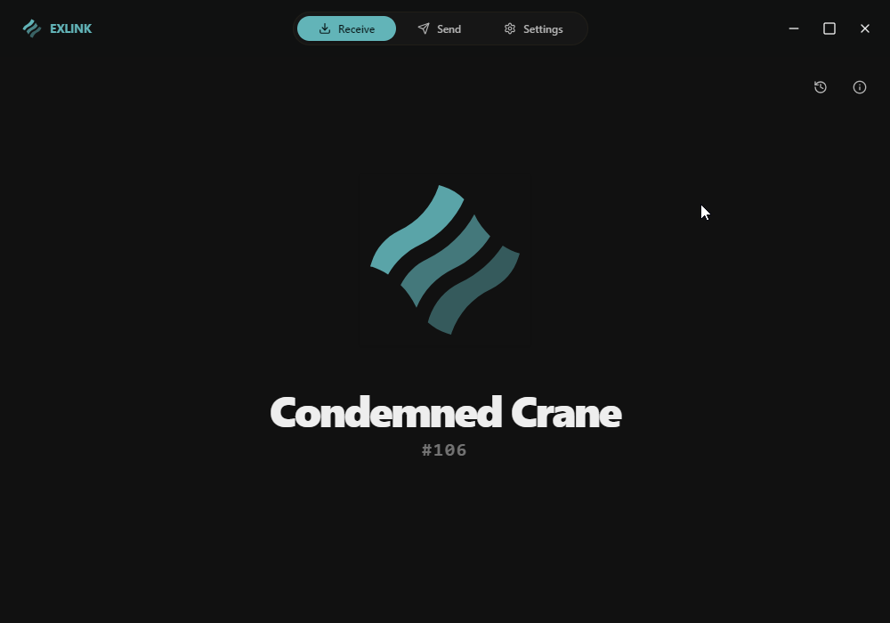
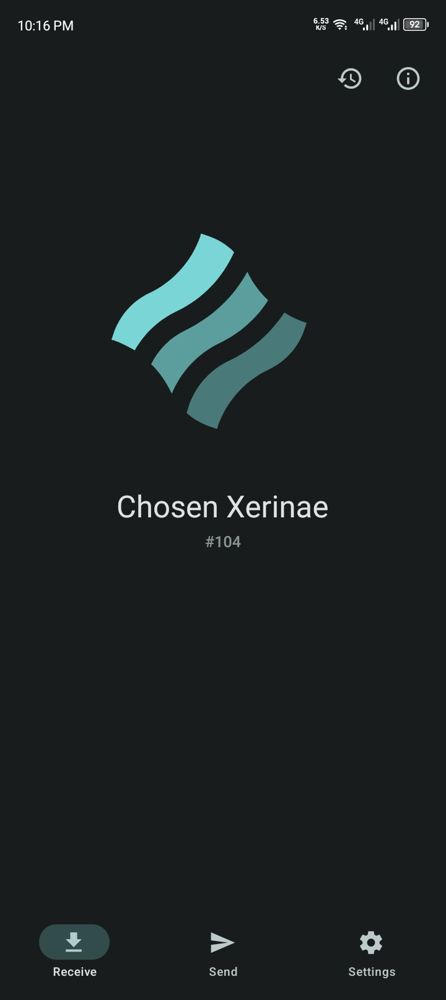
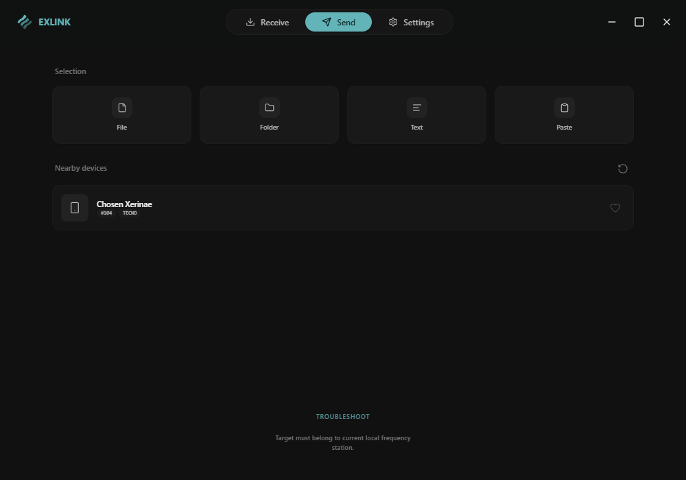
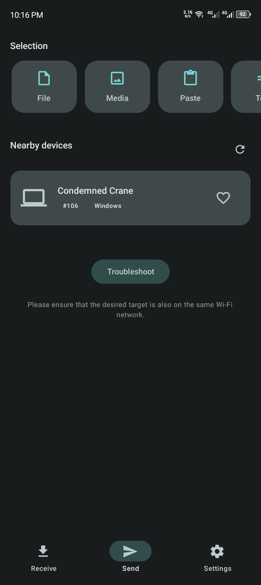

# ExLink File Transfer

<p align="center">
  
  
</p>

A premium, localized file transfer solution designed for speed, simplicity, and seamless cross-platform communication. Transfer files, folders, and text between **Desktop** and **Mobile** with zero configuration.

---

## ✨ Features

- 🚀 **Lightning Fast**: Blazing fast transfers over your local Wi-Fi or LAN.
- 📱 **Cross-Platform**: Seamlessly connect Windows, macOS, and Linux with Android and iOS.
- 🔍 **Auto-Discovery**: Devices on the same network find each other automatically—no IP typing required.
- 🔒 **Privacy First**: Your data never leaves your network. Transfers are peer-to-peer.
- 🎨 **Modern UI**: Clean, responsive design with support for custom themes and dark mode.
- 📋 **Universal Clipboard**: Share text snippets and links instantly across devices.
- 🗂️ **Batch Transfer**: Send multiple files and entire folders in one go.

---

## 📸 App Showcase

### Desktop Experience
<p align="center">
  
  <br>
  <em>The Send screen on Desktop allows for quick file and folder selection with automatic device discovery.</em>
</p>

### Mobile Experience
<p align="center">
  
  
  <br>
  <em>Mobile app features discovery, batch selection, and extensive settings.</em>
</p>

---

## 🛠️ Tech Stack

- **Desktop**: Electron + React + TypeScript + Vite + TailwindCSS + Shadcn/UI
- **Mobile**: Expo Router + React Native Paper + TypeScript
- **Networking**: UDP Discovery + Express (HTTP) Server

---

## 🚀 Getting Started

### Desktop (PC/Mac/Linux)
1.  Navigate to the desktop directory:
    ```bash
    cd desktop
    ```
2.  Install dependencies:
    ```bash
    npm install
    ```
3.  Launch the app:
    ```bash
    npm run dev
    ```

### Mobile (Android/iOS)
1.  Navigate to the mobile directory:
    ```bash
    cd mobile
    ```
2.  Install dependencies:
    ```bash
    npm install
    ```
3.  Start Expo:
    ```bash
    npx expo start
    ```

---

## 📖 How It Works

ExLink uses a custom protocol for discovery and transfer:
- **Discovery**: Devices pulse on UDP port `41234` to announce their presence.
- **Transfer**: File streams are handled via a local HTTP server on port `3030`.
- **Pairing**: A secure-first approach where users must manually accept or decline incoming requests.

*For a deep dive into the protocol, check out [HOW_IT_WORKS.md](./HOW_IT_WORKS.md).*

---

## 🤝 Contributing & Community

We welcome contributions! Whether it's a bug fix, feature request, or UI improvement, please read our [CONTRIBUTING.md](./CONTRIBUTING.md) to get started.

- **Maintainer**: [LW Shakib](https://github.com/lwshakib)
- **Code of Conduct**: [CODE_OF_CONDUCT.md](./CODE_OF_CONDUCT.md)
- **License**: [MIT](./LICENSE)

---

<p align="center">
  Built with ❤️ for a better file sharing experience.
</p>