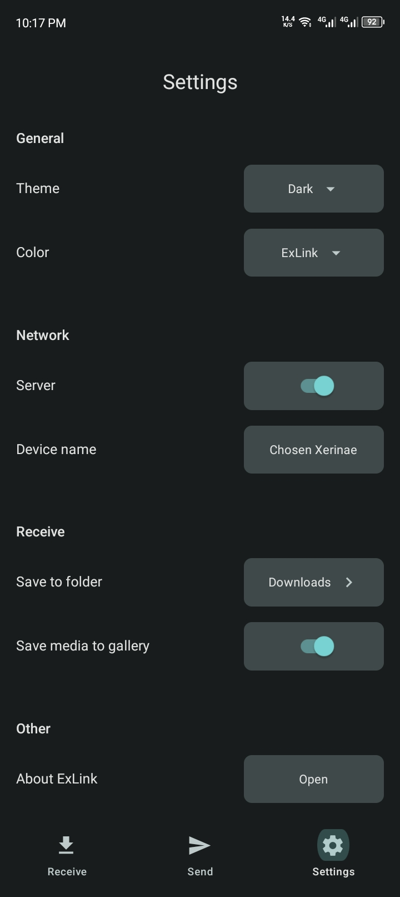
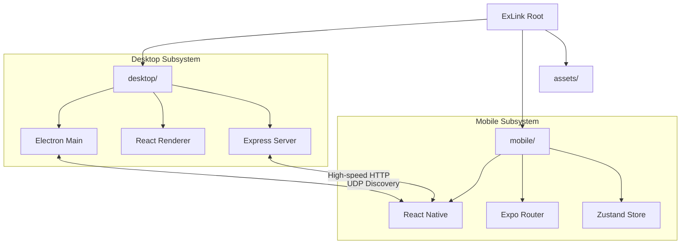

#  ExLink File Transfer

<p align="center">
  
  
</p>

<p align="center">
  <strong>The ultimate high-performance, localized file transfer solution.</strong><br>
  Designed for speed, built for privacy, and crafted with a premium user experience.
</p>

<p align="center">
  
  
  
</p>

---

## 🌟 Overview

ExLink is a powerful, cross-platform file transfer utility that allows you to move files, folders, and text between **Desktop** and **Mobile** devices with zero configuration. By staying entirely within your local network (LAN), ExLink ensures your data is transferred at the maximum speed possible—often exceeding 50MB/s on modern Wi-Fi—while keeping it completely off third-party servers.

## ✨ Key Features

- 🏎️ **Blazing Fast**: Uses optimized HTTP streaming and direct TCP sockets to maximize your local bandwidth. No cloud limits, no throttling.
- 📱 **Universal Compatibility**: A unified experience across Windows, macOS, Linux, Android, and iOS.
- 🛰️ **Zero Configuration Discovery**: Combines UDP broadcasting with intelligent subnet scanning to ensure devices find each other in milliseconds.
- 🔒 **Peer-to-Peer Privacy**: No accounts, no internet required, and no data logs. Your files move directly from one device to another.
- 🎨 **Premium Aesthetic**: A modern, clean UI with Glassmorphism elements, dark mode support, and smooth Framer Motion animations.
- 📋 **Seamless Clipboard**: Share links, snippets, and passwords instantly with the Universal Clipboard feature.
- 📦 **Bulk Transfers**: Select hundreds of files or entire directory trees and watch them transfer in a single parallelized batch.
- 📡 **Real-time Feedback**: Detailed progress bars, per-file speed metrics, and estimated time remaining (ETA) for every transfer.

---

## 🧐 Why ExLink?

| Feature | ExLink | Cloud Storage | Traditional Bluetooth |
| :--- | :---: | :---: | :---: |
| **Speed** | 🚀 Ultra Fast (LAN) | 🐌 Slow (ISP limited) | 🐢 Very Slow |
| **Privacy** | 🔒 100% Local | 🔓 Third-party access | 🔒 Local |
| **File Size Limit** | ♾️ Unlimited | ⚠️ Limited | ⚠️ Limited |
| **Internet Required**| ❌ No | ✅ Yes | ❌ No |
| **Setup Time** | ⚡ Instant | ⏳ Login/App setup | 🛠️ Manual Pairing |

---

## 📸 Visual Showcase

### 🖥️ Desktop Experience
<p align="center">
  
  <br>
  <em>The Desktop Send screen featuring automatic device discovery and intuitive file selection.</em>
</p>

### 📱 Mobile Experience
<p align="center">
  
  
  <br>
  <em>Mobile app optimized for one-handed operation with powerful discovery and batch management.</em>
</p>

---

## 🏗️ Project Structure



## 🛠️ Tech Stack

ExLink is built with a modern, high-performance stack:

| Layer | Technologies |
| :--- | :--- |
| **Desktop** | [Electron](https://www.electronjs.org/), [React](https://reactjs.org/), [Vite](https://vitejs.dev/), [TailwindCSS](https://tailwindcss.com/), [Shadcn UI](https://ui.shadcn.com/) |
| **Mobile** | [React Native](https://reactnative.dev/), [Expo](https://expo.dev/), [Expo Router](https://docs.expo.dev/router/introduction/), [React Native Paper](https://reactnativepaper.com/) |
| **State Management** | [Zustand](https://github.com/pmndrs/zustand) (Desktop & Mobile) |
| **Networking** | Custom UDP Discovery Protocol + High-speed Express HTTP Streaming |

---

## 🚀 Quick Start

### 🏁 Desktop Setup
1. Clone the repository and enter the desktop directory:
   ```bash
   cd desktop
   ```
2. Install dependencies:
   ```bash
   npm install
   ```
3. Run the development environment:
   ```bash
   npm run dev
   ```

### 📲 Mobile Setup
1. Enter the mobile directory:
   ```bash
   cd mobile
   ```
2. Install dependencies:
   ```bash
   npm install
   ```
3. Launch the Expo Go environment:
   ```bash
   npx expo start
   ```

---

## 🔬 How It Works (The ExLink Protocol)

ExLink uses a proprietary discovery and transfer handshake to ensure a seamless experience:

1.  **UDP Pulse**: The Desktop app pulses discovery packets on UDP Port `41234`.
2.  **Subnet Scan**: Mobile devices scan the local subnet and announce themselves to detected Desktops.
3.  **Encrypted Handshake**: A pairing request is initiated where the user must explicitly approve the connection.
4.  **Streaming Transfer**: Files are streamed directly between devices using optimized HTTP chunks on Port `3030`.

> [!TIP]
> For a technical deep-dive into the protocol, check our [HOW_IT_WORKS.md](./HOW_IT_WORKS.md) guide.

---

## 🤝 Contributing

We welcome contributions of all kinds! Whether you are fixing a bug, adding a feature, or improving documentation, we value your help.

- **Development Guide**: See [CONTRIBUTING.md](./CONTRIBUTING.md)
- **Code of Conduct**: Review our [CODE_OF_CONDUCT.md](./CODE_OF_CONDUCT.md)
- **Roadmap**: Check out the [Issues](https://github.com/lwshakib/exlink-file-transfer/issues) for high-priority tasks.

---

## 📜 License & Credits

- **License**: [MIT](./LICENSE)
- **Maintainer**: [LW Shakib](https://github.com/lwshakib)
- **Special Thanks**: To the open-source community for the amazing libraries that make ExLink possible.

---

<p align="center">
  Built with obsession for performance by <strong>LW Shakib</strong>.
</p>
