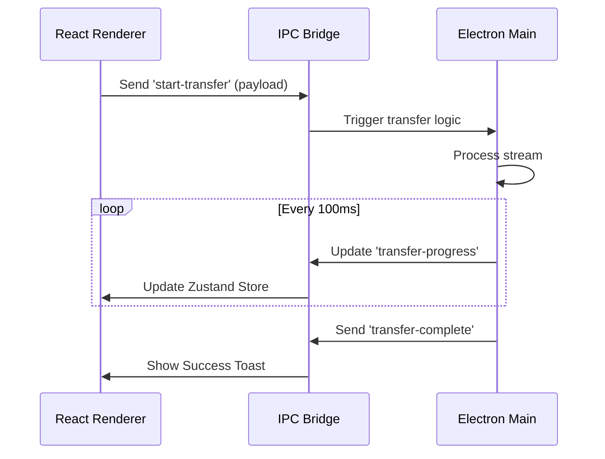

#  ExLink Desktop

### The Central Hub for Local File Transfers

ExLink Desktop is a powerful Electron-based application that serves as the network coordinator for your file transfers. It provides a beautiful, native-feeling interface for discovering devices, managing transfers, and configuring your local node.

---

## 🚀 Key Features

- **High-Performance Server**: Powered by Express.js for low-latency, high-throughput file streaming directly from the file system.
- **Advanced Discovery**: Implements real-time UDP broadcasting and responds to mobile subnet scans.
- **System Integration**: Native file system access for lightning-fast disk I/O and support for large file buffers.
- **Modern UI**: Built with React and TailwindCSS, featuring a premium dark-themed dashboard with smooth state transitions.
- **IPC Orchestration**: Robust communication between the background Node.js process and the graphical renderer.

---

## 🛠️ Tech Stack

- **Framework**: [Electron](https://www.electronjs.org/) (Main & Renderer)
- **Frontend**: [React](https://reactjs.org/) + [TypeScript](https://www.typescriptlang.org/)
- **Build Tool**: [Vite](https://vitejs.dev/) (Optimized for Electron)
- **Styling**: [TailwindCSS](https://tailwindcss.com/) + [Shadcn UI](https://ui.shadcn.com/)
- **Networking**: [Express.js](https://expressjs.com/) (Embedded Binary Server)
- **State**: [Zustand](https://github.com/pmndrs/zustand) + [Electron IPC](https://www.electronjs.org/docs/latest/api/ipc-main)

---

## 🏗️ Architecture & IPC Logic

The application is split into two primary processes:

### 1. The Main Process (`electron/main.ts`)

The "Brain" of the app. It holds the elevated privileges required for:

- Starting the **Express Server** on port 3030.
- Managing **UDP Heartbeats** on port 41234.
- Handling **File System Operations** (Read/Write).
- Managing the system tray and native window controls.

### 2. The Renderer Process (`src/`)

The "Face" of the app. It provides the user interface and communicates with the Main process via Inter-Process Communication (IPC).



---

## 📂 Project Structure

```text
desktop/
├── electron/               # Electron Main process code
│   ├── main.ts             # Entry point for Main process
│   └── preload.ts          # IPC bridge and context isolation
├── src/                    # React Renderer process code
│   ├── components/         # UI Components (Shadcn + Custom)
│   │   ├── layout/         # Navigation and Shell
│   │   └── pages/          # Primary views (Send/Receive/History)
│   ├── hooks/              # Custom React hooks
│   ├── store/              # Zustand global state
│   └── lib/                # Shared utilities
├── public/                 # Static assets (icons, logo)
├── vite.config.ts          # Vite configuration for Electron
└── package.json            # Scripts and dependencies
```

---

## 📥 Development Setup

### Prerequisites

- **Node.js**: v18.0 or later
- **npm** or **bun** (Recommended)

### Installation

```bash
# Navigate to the desktop directory
cd desktop

# Install dependencies
npm install
```

### Running Locally

```bash
# Start the Vite dev server and Electron app
npm run dev
```

### Building for Production

```bash
# Build the production assets and package the app for the current OS
npm run build
```

Produced files will be available in the `dist` and `release` directories. We use `electron-builder` for multi-platform packaging.

---

## 🛰️ Network Configuration

By default, ExLink Desktop uses the following ports:

- **TCP 3030**: Primary HTTP API and file streaming.
- **UDP 41234**: Discovery beacon broadcasting.

> [!IMPORTANT]
> Ensure your OS Firewall allows inbound and outbound traffic on these ports. On Windows, you may need to grant "Private Network" access to the application.

---

## 🔒 Security Note

ExLink Desktop operates exclusively within your Local Area Network (LAN). No data is sent to external servers. Always ensure you are connected to a trusted local network when performing transfers.

---

<p align="center">
  Part of the <strong>ExLink Ecosystem</strong>
</p>
