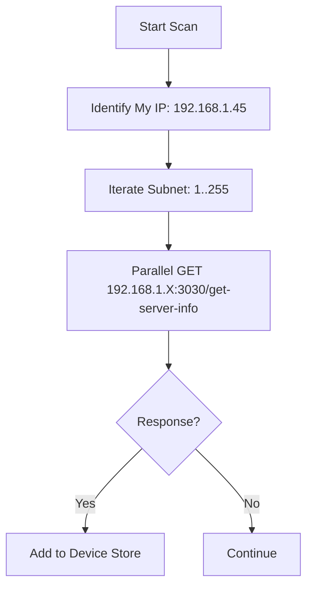

#  ExLink Mobile

### Seamless File Transfer on the Go

ExLink Mobile is a fast, lightweight companion app built with React Native and Expo. It allows you to discover ExLink Desktop nodes on your network, send files in batches, and receive content with ease via an optimized pull-based architecture.

---

## 🚀 Key Features

- **Smart Discovery**: Automatically scans your local IPv4 subnet to find active ExLink Desktop hubs, bypassing router-level UDP blocks.
- **Batch Selection**: Leverage native file pickers to select multiple photos, videos, or documents and send them in a single streaming session.
- **Universal Clipboard**: Fast, one-tap text and link sharing between your mobile device and your computer.
- **Optimized Download**: Efficient pull-based downloading ensures high reliability on iOS and Android, even with background task limitations.
- **Native Experience**: Smooth transitions, Haptic feedback, and a responsive layout built for one-handed operation.

---

## 🛠️ Tech Stack

- **Framework**: [React Native](https://reactnative.dev/) + [Expo](https://expo.dev/)
- **Navigation**: [Expo Router](https://docs.expo.dev/router/introduction/) (File-system based routing)
- **UI Components**: [React Native Paper](https://reactnativepaper.com/) (Material Design 3)
- **State Management**: [Zustand](https://github.com/pmndrs/zustand) (Persistent discovery & settings)
- **Persistence**: [AsyncStorage](https://react-native-async-storage.github.io/async-storage/) (Device Identity)
- **Networking**: [Axios](https://axios-http.com/) + Native Fetch

---

## 🔍 Discovery & Subnet Scanning

ExLink Mobile uses a "Two-Fold Discovery" strategy to guarantee connectivity:

### 1. The Active Scan

If the device doesn't detect a UDP pulse from a desktop, it initiates a subnet scan.



### 2. The UDP Listener

The app listens for incoming UDP packets on port `41234` containing the desktop's identity and connection details.

---

## 📂 Project Structure

```text
mobile/
├── app/                    # Expo Router Screen Definitions
│   ├── (tabs)/             # Tab-based navigation (Send/Receive/Settings)
│   ├── _layout.tsx         # Root layout and providers
│   └── index.tsx           # Entry splash/discovery screen
├── components/             # Reusable UI modules
│   ├── device/             # Device list and discovery items
│   ├── portal/             # Sending/Receiving progress overlays
│   └── common/             # Buttons, Cards, and Inputs
├── hooks/                  # Logic for subnet scanning and socket events
├── store/                  # Zustand stores (Discovery, History, App)
├── constants/              # Theme colors, Port configs, etc.
└── package.json            # Scripts and dependencies
```

---

## 📥 Development Setup

### Prerequisites

- **Node.js**: v18.0 or later
- **Expo Go App**: Installed on your physical device ([iOS](https://apps.apple.com/app/expo-go/id982107779) / [Android](https://play.google.com/store/apps/details?id=host.exp.exponent))

### Installation

```bash
# Navigate to the mobile directory
cd mobile

# Install dependencies
npm install
```

### Running Locally

```bash
# Start the Expo development server
npx expo start
```

Scan the QR code displayed in your terminal using the **Expo Go** app (Android) or the **Camera app** (iOS). Ensure both devices are on the same Wi-Fi network.

---

## ⚠️ Important Considerations

- **Network Permissions**: Ensure you grant "Local Network Access" on iOS when prompted.
- **Battery Optimization**: On Android, you may need to disable "Battery Optimization" for ExLink to ensure large background transfers aren't interrupted.
- **Subnet Matching**: Your mobile device must be on the same Wi-Fi subnet (e.g., both on `192.168.1.x`) as the desktop hub.

---

<p align="center">
  Part of the <strong>ExLink Ecosystem</strong>
</p>
